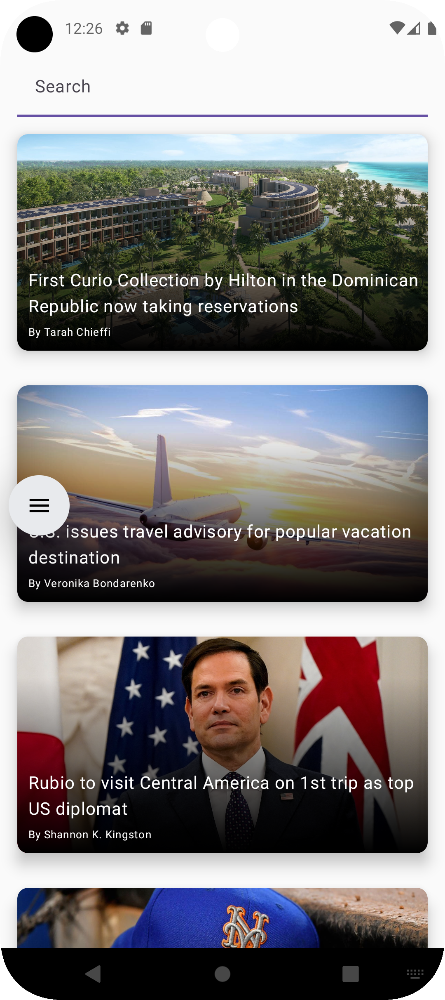
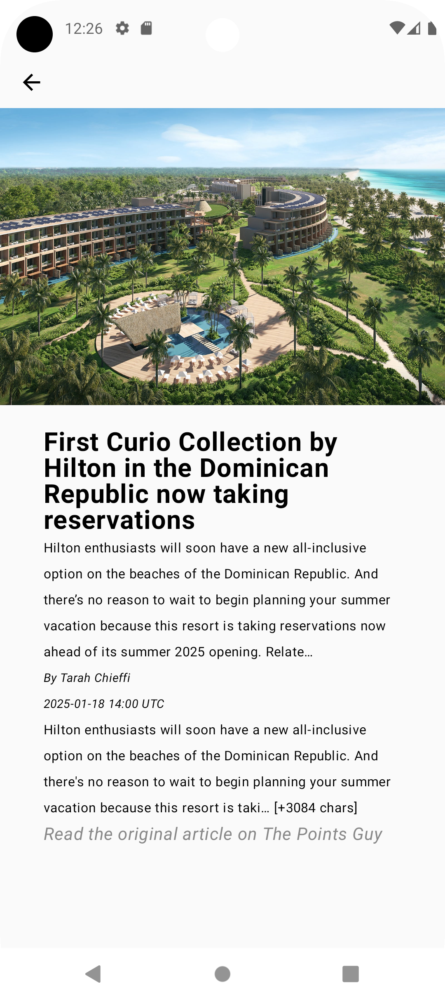
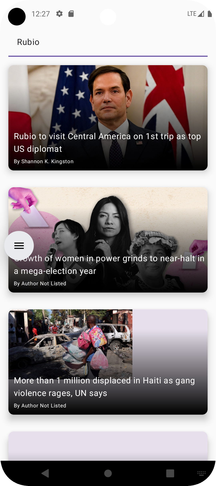

DR Daily is a demo app which shows all new articles about the Dominican Republic(For the unaware, the Dominican Republic is a country in the Caribbean).

The app uses jetpack compose, Retrofit for API handling, & the NewsAPI from [NewsAPI.org]([url](https://newsapi.org/)) for news articles.

When the article card is clicked, the actual article content isn't shown in it's entirety as the API limits the length. I included it anyways as I wanted to play around with dynamic navigation.

Articles can be filtered by using the search bar which shows alters the shown articles by way of View Model.

# Pics of App

